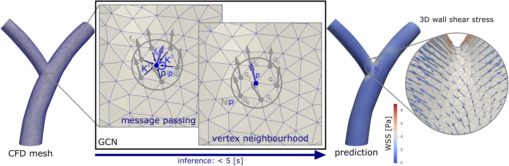
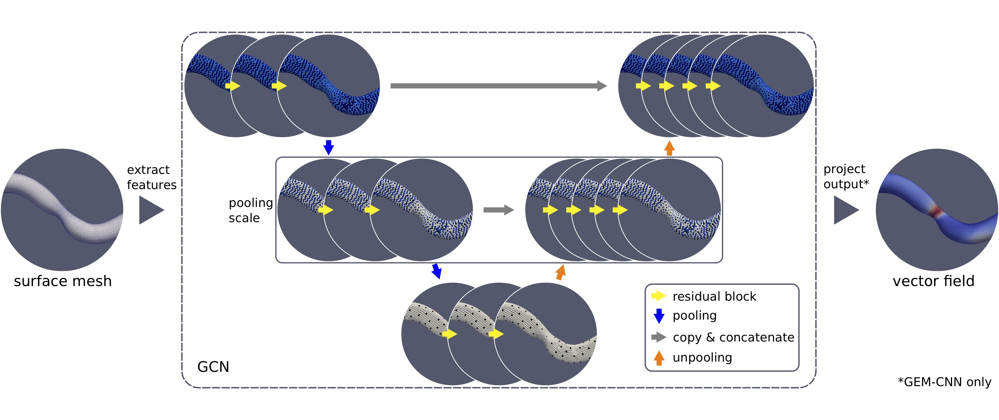

# Coronary mesh convolution


This repository contains code accompanying our (MICCAI 2021) "Workshop on Statistical Atlases and Computational
Modelling of the Heart" (STACOM) paper "Mesh convolutional neural networks for wall shear stress estimation in 3D artery
models". For questions regarding the usage and implementation feel free to [contact me](mailto:j.m.suk@utwente.nl).

## Dependencies & packages
Dependencies:
* Python (tested on 3.8.12)
* PyTorch (tested on 1.10.0)
* PyTorch Geometric "PyG" (tested on 2.0.2) with
  * torch-cluster (tested on 1.5.9)
  * torch-scatter (tested on 2.0.9)
  * torch-sparse (tested on 0.6.12)

Packages:
```
pip install prettytable
pip install vtk
pip install trimesh
pip install potpourri3d
pip install tensorboard
```

Gauge-equivariant mesh convolution
```
git clone https://github.com/Qualcomm-AI-research/gauge-equivariant-mesh-cnn.git
cd gauge-equivariant-mesh-cnn
pip install .
```

## Set-up
We adapt the dataset directory structure
[used by PyTorch Geometric ("PyG")](https://pytorch-geometric.readthedocs.io/en/latest/notes/create_dataset.html). The
directory with the dataset should contain a folder "raw" with the unprocessed data. Pre-processing creates a folder
"processed" with the transformed data.

In our experiments we use the VTP file format to store polygon meshes and corresponding vector fields. We organise our
data in two folders labelled "surface" and "inlet". These contain the complete surface meshes and inlet boundary
meshes, respectively. We use the latter to identify inlet boundary vertices for computation of geodesic distances
(compare "utils/inlet.py" lines 48-49 and 80-81). It may be necessary to adapt the code for this procedure to different
data.

Paths to the folder containing the "raw" directory with content specified in a
search pattern have to be set for each dataset in "experiments/template.py" (compare lines 41-42 and 59-60).

Hyperparameters for neural network training are set in an experiment file, e.g. "experiments/compare.py".

Experiments are run by executing
```
python main.py
```
and produce visualised output in the "vis" directory which can be viewed with e.g. ParaView (https://www.paraview.org/).

Training curves can be viewed with TensorBoard for PyTorch via
```
tensorboard --logdir=runs
```

If desired, scalar training labels can be used (e.g. wall shear stress magnitude) by enabling line 43 in
"utils/dataset_tools.py" and deleting the pre-processed dataset.

## Repository structure
This repository follows the PyTorch Geometric ("PyG") convention for implementing graph neural networks. The dataset
class is implemented in the directory "datasets". Neural networks are implemented in "models". Their building blocks
like convolution and pooling are implemented in "nn". The folder "transforms" contains several graph transforms for
pre-processing. Multiple helper functions and utility are outsourced in the folder "utils".

## Network layout

This repository implements a three-scale mesh convolutional residual neural network with GraphSAGE, FeaSt
and (now also) gauge-equivariant convolution. For details refer to our paper ["Mesh convolutional neural networks
for wall shear stress estimation in 3D artery models"](https://arxiv.org/abs/2109.04797).

## Data
We are willing to share our synthetic coronary artery dataset. If you are interested send me an
[e-mail](mailto:j.m.suk@utwente.nl).

## Publication
If you found this repository useful, please consider citing our paper:
```
@inproceedings{Suk/et/al/2021,
  author = {Julian Suk and Pim de Haan and Phillip Lippe and Christoph Brune and Jelmer M. Wolterink},
  title = {Mesh convolutional neural networks for wall shear stress estimation in 3D artery models},
  booktitle = {Statistical Atlases and Computational Models of the Heart},
  year = {2021}
}
```
